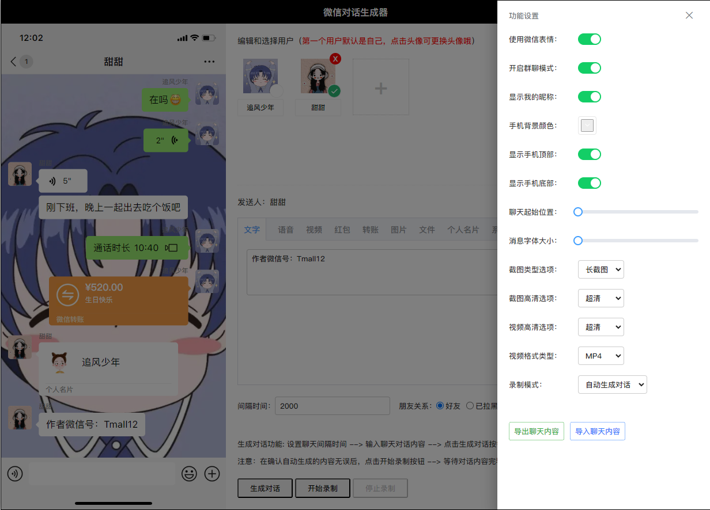

<h1 align="center">微信对话生成器</h1>

<h4 align="center">微信对话生成器，是一款聊天记录制作工具，可以模拟微信聊天，可以添加不同用户角色进行对话，支持发送文字、语音、图片、红包、转账等。可以将聊天内容一键生成为图片、长截图、动态图片和视频。</h4>
<h4 align="center">抖音上常见的聊天记录视频，使用这款工具可以轻松制作出来</h4>
<div align="center">

[](https://gitee.com/lifeixue/weixin-chat)  [](https://gitee.com/lifeixue/weixin-chat)  []()

```shell
注意：此版本为基础版，高级版暂不对外开放
```
------------------------------------------------------------------------
</div>

<h1 align="center">基础版（免费）</h1>

## 在线微信聊天生成器，抖音微信聊天搞笑视频制作神器

## 更新日志
2023-01-05：修复年份选项问题，增加年份选项到2027  
2023-01-05：新增生成图片功能（该功能需要将项目部署在服务器上）  
2023-01-05：新增生成视频功能（该功能需要将项目部署在服务器上）  
2023-01-07：成品（解决无法右击保存生成好的图片）  
2023-01-07：成品（添加菜单栏刷新功能,用于解决录制视频后需重启才能二次录制的问题）  
2023-01-09：新增生成GIF功能  
控制发送间隔时间（待开发）  
高清录制MP4格式视频功能（待开发）  
### 温馨提示：小白的话建议下载 wxchat-win32-x64.zip 成品，下载解压后鼠标双击 wxchat.exe 运行即可

## 演示图例
  


<h1 align="center">高级版（电脑端，收费）</h1>

## 功能更强大，界面更简洁，使用更简单

## 高级版功能介绍
新增一键生成对话功能，可以控制聊天发送间隔时间（无需边录制边输入）  
新增高清录制MP4视频功能（可录制高清、超清、蓝光）  
新增长截图功能  
新增发送表情功能  
新增视频通话、语音通话、消息撤回等功能  
新增数据缓存功能，刷新页面/重启软件内容不会丢失  
新增音效功能（发送消息时带音效）  
2023-05-12：新增对话内容修改功能  
2023-05-12：新增拒绝消息功能  
2023-05-18：新增对话内容移动功能  
2023-05-21：新增手动一键生成对话功能，发送消息间隔时间随心所欲（无需边录制边输入）  
2023-05-23：新增微信表情功能（微信 + Emoji）  
2023-05-30：新增群聊模式（修复用户昵称不显示的问题）  
2023-05-30：新增聊天内容导入和导出功能  
2023-06-10：新增苹果微信字体  
2023-06-10：修复清空聊天记录后需要最小化后才能输入内容的BUG  
2023-06-15：新增从底部开始聊（消息对话从下往上弹出）  
2023-06-15：新增自定义长截图的背景颜色  
2023-06-28：修复无法换行输入和发送GIF表情包及其它优化  
2023-06-30：修复个别设备在生成视频后，视频中的消息框出现轻微抖动的现象  
2023-07-08：新增小说推文模式  
2023-07-08：新增删除/拉黑提示功能  
2023-07-10：新增发送文件功能  
2023-07-10：优化其它及修复群聊昵称过长导致消息框样式的问题  
2023-08-01：近期在开发手机版,手机版预计在8月底完成  
更多功能.....

## 演示图例
  
  


<h1 align="center">高级版（手机端，开发中）</h1>

## 同微信界面一样，像微信一样操作（预计8月底完成）

2023-08-01：像微信一样聊天（完成）    
2023-08-01：添加/删除/编辑好友（完成）  
2023-08-01：零钱充值、提现（完成）  
2023-08-01：零钱明细（完成）  

## 特别声明
此软件只用于娱乐使用，切勿用于非法途径，由此产生任何纠纷由使用者本人自己承担，禁止用于各种违法犯罪行为！！