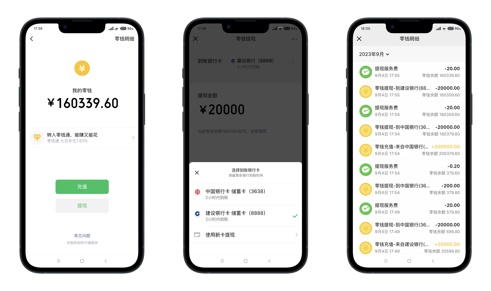
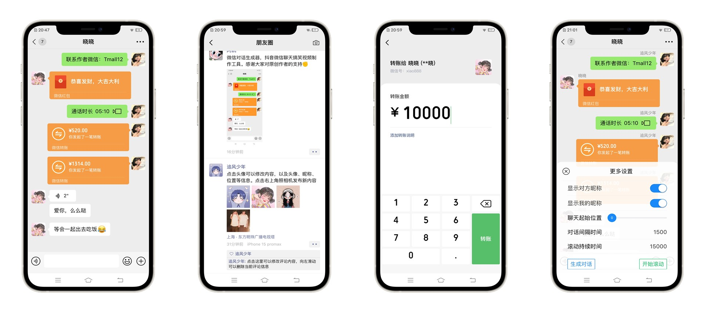

<h1 align="center">微信对话生成器</h1>

<h4 align="center">微信对话生成器，抖音微信聊天记录视频制作工具，是一款模拟微信聊天的工具，可以添加不同用户角色进行对话，支持发送文字、语音、图片、红包、转账等。可以将聊天记录一键生成为图片、长截图、动态图片和视频。</h4>
<h4 align="center">抖音上常见的聊天记录视频，使用这款工具可以轻松制作出来</h4>
<div align="center">

[](https://gitee.com/lifeixue/weixin-chat)  [](https://gitee.com/lifeixue/weixin-chat)  []()

```shell
注意：此版本为基础版，高级版暂不对外开放
```

### 感谢大家对原创作者的支持！由于支持原创用户较多，导致微信"被加好友频繁"（可能收不到您的好友验证请求）  
### 可以添加备用微信号：yjc130604，或关注抖音号：yp071121
------------------------------------------------------------------------
</div>

<h1 align="center">基础版（免费）</h1>

## 在线微信聊天生成器，抖音微信聊天搞笑视频制作神器

## 更新日志
2023-01-05：修复年份选项问题，增加年份选项到2027  
2023-01-05：新增生成图片功能（该功能需要将项目部署在服务器上）  
2023-01-05：新增生成视频功能（该功能需要将项目部署在服务器上）  
2023-01-07：成品（解决无法右击保存生成好的图片）  
2023-01-07：成品（添加菜单栏刷新功能,用于解决录制视频后需重启才能二次录制的问题）  
2023-01-09：新增生成GIF功能  
控制发送间隔时间（待开发）  
高清录制MP4格式视频功能（待开发）  
### 温馨提示：小白的话建议下载 wxchat-win32-x64.zip 成品，下载解压后鼠标双击 wxchat.exe 运行即可

## 演示图例
  


<h1 align="center">高级版（电脑端）</h1>

## 功能更强大，界面更简洁，使用更简单

## 高级版功能介绍
新增一键生成对话功能，可以控制聊天发送间隔时间（无需边录制边输入）  
新增高清录制MP4视频功能（可录制高清、超清、蓝光）  
新增长截图功能  
新增发送表情功能  
新增视频通话、语音通话、消息撤回等功能  
新增数据缓存功能，刷新页面/重启软件内容不会丢失  
新增音效功能（发送消息时带音效）  
2023-05-12：新增对话内容修改功能  
2023-05-12：新增拒绝消息功能  
2023-05-18：新增对话内容移动功能  
2023-05-21：新增手动一键生成对话功能，发送消息间隔时间随心所欲（无需边录制边输入）  
2023-05-23：新增微信表情功能（微信 + Emoji）  
2023-05-30：新增群聊模式（修复用户昵称不显示的问题）  
2023-05-30：新增聊天内容导入和导出功能  
2023-06-10：新增苹果微信字体  
2023-06-10：修复清空聊天记录后需要最小化后才能输入内容的BUG  
2023-06-15：新增从底部开始聊（消息对话从下往上弹出）  
2023-06-15：新增自定义长截图的背景颜色  
2023-06-28：修复无法换行输入和发送GIF表情包及其它优化  
2023-06-30：修复个别设备在生成视频后，视频中的消息框出现轻微抖动的现象  
2023-07-08：新增小说推文模式  
2023-07-08：新增删除/拉黑提示功能  
2023-07-10：新增发送文件功能  
2023-07-10：优化其它及修复群聊昵称过长导致消息框样式的问题  
2023-08-01：近期在开发手机版,手机版预计在8月底完成  
2023-08-30：修复其它及新增语音播放功能  
2023-08-30：新增一些小功能和细节上就不一一介绍了  
2023-10-09：新增随机生成用户头像功能  
2023-10-09：新增语音转文字功能  
2023-10-09：新增发送个人名片功能  
2023-10-09：支持聊天页面显示对方昵称/我的昵称  
2023-10-09：修复无法修改聊天图片的问题  
2023-10-09：修复一些已知问题及界面优化  
2023-10-28：新增消息互换身份功能（将消息切换为对方/我发送的）  
2023-10-28：新增拖拽移动消息功能（拖拽消息框移动消息位置）  
2023-10-28：修复一些已知问题  
2023-11-19：新增发送视频文件功能  
2023-11-19：新增图片及视频预览功能  
2023-11-19：新增自定义昵称及系统消息等文字大小  
2023-11-19：新增一键恢复所有设置功能  
2023-11-19：修复不能随机更换自己的头像及一些已知问题  
2024-01-08：新增转账退回功能  
2024-01-08：新增一键生成视频功能（消息弹出效果）  
2024-01-08：新增一键生成滚动视频功能（消息滚动效果）  
2024-01-08：新增视频音效功能（消息提示音,可自定义）  
2024-01-08：新增自定义视频比例、消息间隔时间、持续时间等功能  
2024-01-08：优化生成视频功能，生成视频相较之前更方便、更快捷、更强大  
2024-01-08：修复一些已知问题及优化  
2024-02-18：新增暗夜主题功能（深色模式）  
2024-02-18：优化截图速度  
2024-02-18：修复3:4比例视频生成失败的问题及其它  
2024-03-25：新增批量截图功能  
2024-03-25：新增透明聊天背景（可截取透明背景图片）  
2024-03-25：优化生成视频功能  
2024-03-25：修复一些已知问题以及其它优化  
2024-04-22：新增切换默认用户功能（将某用户设置为自己）  
2024-04-22：优化生成视频功能  
2024-04-22：修复一些已知问题及界面优化等  
2024-05-19：新增消息引用功能等  
2024-05-19：修复一些已知问题  
2024-06-16：新增消息合并转发功能  
2024-06-16：新增链接分享功能  
2024-06-16：新增生成视频进度查看功能  
2024-06-16：修复滚动视频轻微抖动问题，让滚动效果更加平滑  
2024-06-16：修复一些已知问题及其它功能优化  
更多功能.....

## 演示图例
  
  


<h1 align="center">高级版（手机端）</h1>

## 同微信界面一样，像微信一样操作（仅支持安卓）  

2023-09-12：支持发送微信表情、文字、语音、图片、红包、转账等  
2023-09-12：支持添加、删除和编辑好友  
2023-09-12：支持零钱充值、提现和查看零钱明细  
2023-09-12：支持自定义聊天背景以及设置当前聊天背景  
2023-09-12：支持消息编辑、删除、移动位置等  
2023-09-12：支持对方删除/拉黑后消息被拒收提示  
2023-09-12：支持聊天内容自动滚动、自动逐条发送  
2023-09-12：支持自定义聊天内容滚动速度，及消息发送间隔时间  
2023-09-12：支持自定义聊天内容起始位置（例如：从下往上发送消息/从下往上滚动）  
2023-09-12：支持聊天页面显示对方昵称/我的昵称  
2023-09-12：支持自定义消息未读数量  
2023-09-20：修复设置保存后状态栏适配的问题及其它优化处理  
2023-09-20：新增随机生成用户头像  
2023-09-20：新增群聊功能（创建、编辑、删除）  
2023-10-12：新增发送个人名片，语音转文字等功能  
2023-10-12：新增批量删除联系人和群聊功能  
2023-10-12：修复无法修改聊天图片及一些已知问题  
2023-10-12：解决点击手机物理返回键会退出软件的问题  
2023-11-02：新增消息互换身份功能（将消息切换为对方/我发送的）  
2023-11-02：修复一些已知问题  
2023-11-12：新增朋友圈功能  
2023-11-12：新增新的朋友页面(好友验证页面)  
2023-11-12：新增转账页面  
2023-11-12：新增图片预览功能  
2023-11-12：修复一些已知问题  
2023-12-10：新增转账退回功能  
2023-12-10：新增自定义昵称及系统消息等文字大小  
2023-12-10：修复不能随机更换自己的头像及一些已知问题  
2023-12-11：新增发送视频文件及视频播放功能  
2023-12-11：修复一些已知问题及部分优化  
2024-03-17：新增查看个人资料页面  
2024-03-17：新增零钱明细编辑功能  
2024-03-17：发现页-朋友圈可指定联系人发圈  
2024-03-17：修复无法复制粘贴问题  
2024-03-17：修复一些已知问题及其它优化  
2024-04-26：新增置顶聊天功能  
2024-04-26：新增群聊天信息页面  
2024-04-26：新增邀请好友进群功能  
2024-04-26：新增删除群用户功能  
2024-04-26：新增支付加载动画  
2024-04-26：新增发起红包和转账时显示数字键盘和密码键盘  
2024-04-26：新增零钱充值和提现时显示数字键盘和密码键盘  
2024-04-26：优化发红包和转账功能  
2024-04-26：修复9人以上群聊头像显示问题  
2024-04-26：修复一些已知问题及其它优化等  
2024-05-19：新增消息引用功能  
2024-05-19：新增关键词自动回复功能  
2024-05-19：修复设置背景后系统提示没有白底的问题  
2024-05-19：修复一些已知问题及其它优化  
2024-06-16：新增消息合并转发功能  
2024-06-16：新增链接分享功能  
2024-06-16：新增模拟自动被加好友功能  
2024-06-16：修复一些已知问题及其它功能优化  
更多功能.....

## 演示图例
  



## 倒卖可耻
目前发现有不少人倒卖我的微信对话生成器！本人并没有以任何形式推广过本程序，您无论是在抖音、B站、某宝等看到的都属于倒卖！谨防上当受骗！

## 特别声明
此软件只用于娱乐使用，切勿用于非法途径，由此产生任何纠纷由使用者本人自己承担，禁止用于各种违法犯罪行为！！